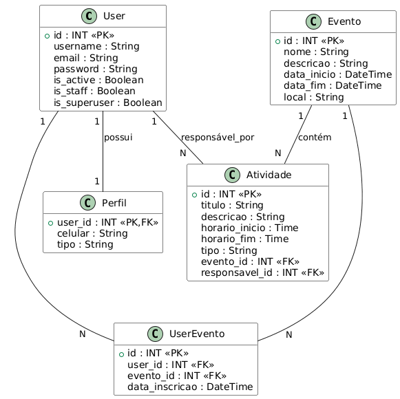
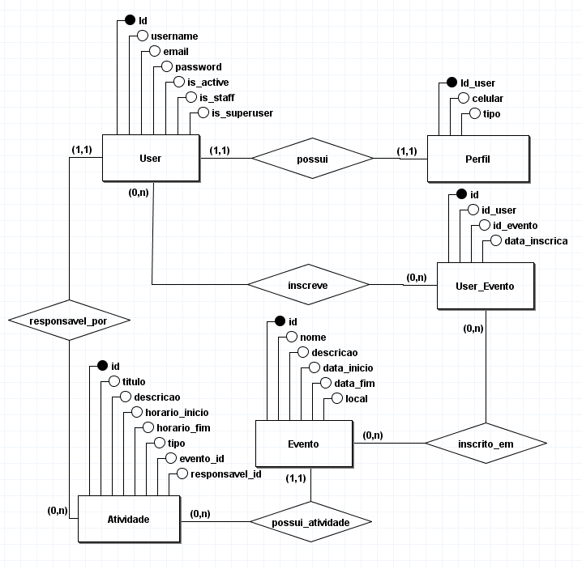

# 📘 Gertão de Eventos - Project API

[](https://www.python.org/downloads/)
[](https://www.djangoproject.com/)
[](https://www.sqlite.org/)
[](https://opensource.org/licenses/MIT)

---

## Instituições de Fomento e Parceria

[](https://www.ifb.edu.br/)  
 [](https://hardware.org.br/)

---

## Orientador

[Diego Martins](https://github.com/diegomo2)

---

## Sumário

- [Visão Geral](#visão-geral)
- [Pacotes Utilizados](#pacotes-utilizados)
- [Estrutura do Projeto](#estrutura-do-projeto)
- [Diagrama de Banco de Dados](#diagrama-de-banco-de-dados)
- [Documentação da API](#documentação-da-api)
- [Configuração do Ambiente](#configuração-do-ambiente)
- [Deploy](#deploy)

---

## Visão Geral

Este projeto implementa uma **API de Gestão de Eventos** voltada para organizar congressos, palestras e workshops.  
O sistema permite gerenciar **Eventos**, **Atividades** e **Participantes**, com as regras de permissões:

- **Admin** → pode visualizar, criar, editar e excluir eventos e atividades, fazer inscrições e cadastrar participantes e definir responsáveis das atividades.
- **Participante/Usuário/Palestrante** → pode consultar eventos, conferir a inscrição e visualizar atividades dos eventos.

Funcionalidades principais:

- **CRUD Completo:** Gestão de Eventos e Atividades.
- **Inscrições:** Vínculo de participantes em eventos (N:N).
- **Dashboard API:** Rota consolidada com dados do evento, atividades e inscritos.
- **Dashboard Administrativo:** Painel visual com gráficos, métricas em tempo real e atalhos rápidos no Django Admin.
- **Certificados em PDF:** Geração automática de certificados de participação com layout profissional e cálculo dinâmico de carga horária.
- **Carga de Dados:** Script automatizado para importação de dados via CSV.
- **Documentação:** Interface interativa com Swagger e ReDoc via spetacular.

---

## Pacotes Utilizados

| Pacote                  | Versão | Descrição               |
| ----------------------- | ------ | ----------------------- |
| Django                  | ≥5.0   | Framework principal     |
| django-filter           | latest | Função filter do django |
| djangorestframework     | latest | API REST                |
| drf-spectacular         | latest | Documentação OpenAPI    |
| drf-spectacular-sidecar | latest | UI Swagger/ReDoc        |
| django-cors-headers     | latest | Segurança do HTML       |
| django-jazzmin          | latest | Tema do Admin           |
| xhtml2pdf               | latest | Geração de PDFs         |

> **Nota:** Consulte o arquivo `requirements.txt` para a lista completa e versões exatas.

---

## Estrutura do Projeto

```bash
GRUPO-01-GESTAO-DE-EVENTOS/
├── manage.py
├── requirements.txt
├── README.md
├── data/
│   ├── atividades.csv
│   ├── eventos.csv
│   └── ...
├── frontend/
│   └── index.html #painel de visualização para participantes
├── projeto/
│   ├── settings.py
│   ├── urls.py
│   └── ...
├── gestaoEventos/
│   ├── admin.py
│   ├── models.py
│   ├── serializers.py
│   ├── views.py
│   ├── utils.py                 # Lógica de geração de PDF
│   ├── management/
│   │   └── commands/
│   │       └── importar_dados.py
│   ├── templatetags/            # Tags customizadas para o Dashboard
│   │   └── dashboard_tags.py
│   └── templates/
│       ├── admin/               # Customização do Jazzmin/Dashboard
│       │   ├── index.html
│       │   └── app_list.html
│       └── relatorios/          # Templates dos Certificados
│           ├── base_pdf.html
│           ├── certificado.html
│           ├── relatorios_atividades.html
│           └── ...
└── docs/
    ├── codigos_diagramas/
    │   ├── DER_banco.pu
    │   └── MER_banco.brM3
    ├── 01-Enunciado.md
    ├── 02-Documentacao-extra.md
    ├── 03-DER_banco.png
    └── 04-MER_banco.png

```

- **projeto/** → configurações principais do Django.
- **gestaoEventos/** → aplicação principal com modelos, views, lógica de relatórios, customizações do admin, serializers e rotas.
- **docs/** → documentação auxiliar (diagramas, imagens).

---

## Diagrama de Banco de Dados

DER:



MER:



# Diagrama ER – DevLab Project API

## Entidades e Relacionamentos

### **Evento (A)**

| Campo       | Tipo      | Descrição               |
| ----------- | --------- | ----------------------- |
| id          | PK        | Identificador do evento |
| nome        | CharField | Nome do evento          |
| descricao   | TextField | Descrição               |
| data_inicio | DateField | Data de início          |
| data_fim    | DateField | Data de término         |
| local       | CharField | Localização             |

---

### **Atividade (B)**

| Campo          | Tipo          | Descrição                       |
| -------------- | ------------- | ------------------------------- |
| id             | PK            | Identificador da atividade      |
| titulo         | CharField     | Nome da atividade               |
| descricao      | TextField     | Descrição                       |
| horario_inicio | DateTimeField | Início                          |
| horario_fim    | DateTimeField | Fim                             |
| tipo           | CharField     | Tipo (palestra, oficina…)       |
| evento_id      | FK            | Relacionamento com Evento       |
| responsavel_id | FK            | Relacionamento com Participante |

---

### **Participante "User" (C)**

| Campo   | Tipo       | Descrição                               |
| ------- | ---------- | --------------------------------------- |
| id      | PK         | Identificador                           |
| nome    | CharField  | Nome completo                           |
| email   | EmailField | Email                                   |
| celular | CharField  | Telefone                                |
| tipo    | CharField  | Perfil (aluno, palestrante, convidado…) |

### **UserEvento "Inscrição" (D)**

| Campo          | Tipo      | Descrição                              |
| -------------- | --------- | -------------------------------------- |
| id             | PK        | Identificador                          |
| user_id        | FK        | Relacionamento com user (participante) |
| evento_id      | Fk        | Relacionamento com evento              |
| data_inscricao | CharField | Telefone                               |

---

## 🔗 Relacionamentos

- **Evento (1) ↔ (N) Atividade**  
  Um Evento pode ter várias atividades, mas cada atividade pertence a um único evento.

- **Evento (N) ↔ (N) Participante (User)**  
  Um evento pode ter vários participantes, e um participante pode inscrever em vários eventos por meio da tabela UserEvento.

- **Perfil (1) ↔ (1) Participante (User)**  
  Uma participante tem um perfil, e um perfil pode ser apenas de um participante.

- **Participante (User) (1) ↔ (N) Atividade**  
  Um Participante pode ser responsável por várias atividades, mas cada atividade pode ter apenas um único resposável.

---

## 📐 Representação Visual em Texto

**Entidades principais:**

- **Evento** → agrupa vários eventos.
- **Atividade** → pertence a um evento, tem um responsável.
- **User** → pode estar em vários eventos.

Relacionamentos:

- Evento ↔ Atividade → **1:N**
- Evento ↔ User (participante) → **N:N**
- Perfil ↔ User (Complemento) → **1:1**
- Atividade ↔ User (responsável) → **1:N**

---

## Documentação da API

A documentação interativa está disponível em:

- `/api/schema/` → Arquivo OpenAPI
- `/api/docs/` → Swagger UI / spectacular
- `/api/docs/redoc/` → ReDoc

### Endpoints Principais

| Método | Endpoint                           | Descrição                            | Auth     |
| ------ | ---------------------------------- | ------------------------------------ | -------- |
| GET    | `/api/eventos/`                    | Lista todos os eventos e atividades  | Opcional |
| GET    | `/api/eventos/{id}/dashboard/`     | Detalhes completos com as inscrições | Opcional |
| GET    | `/api/atividades/`                 | Lista atividades                     | Opcional |
| GET    | `/api/atividades/{id}/`            | Detalhes da atividade                | Opcional |
| GET    | `/api/participantes/{id}/`         | Detalhes do participante             | Opcional |
| GET    | `/api/eventos/{id}/participantes/` | Lista de inscritos no evento         | Opcional |

## Configuração do Ambiente

1. **Clone o repositório:**

   ```bash
      git clone https://github.com/alissonguarnier/Grupo-01-Gestao-de-Eventos/
      cd Grupo-01-Gestao-de-Eventos
   ```

2. **Crie um ambiente virtual:**

   ```bash
      python -m venv .venv
      source .venv/bin/activate  # Linux/Mac
      .venv\Scripts\activate     # Windows
   ```

3. **Instale as dependências:**

   ```bash
   pip install -r requirements.txt
   ```

4. **Aplique as migrações do banco:**

   ```bash
   python manage.py migrate
   ```

5. **Populando o banco de dados:**

   ```bash
   python manage.py importar_dados
   ```

6. **Criando o Super User:**

   ```bash
      python manage.py createsuperuser
   ```

7. **Iniciando o server:**

   ```bash
      python manage.py runserver
   ```

## Front-End

### Abrindo e utilizando o front end (visualização para participantes):

1. **instale a extenção [Live server](https://marketplace.visualstudio.com/items?itemName=ritwickdey.LiveServer) no Visual Studio**;

2. **Localize o arquivo index.html no caminho abaixo;**

   ```bash
   GRUPO-01-GESTAO-DE-EVENTOS/
   └── frontend/
       └── index.html
   ```

3. **Abra o arquivo com o "Open with Live Server";**

4. **Faça o login com o Super User criado.**

## Emitindo relatórios e certificados

### Para emitir relatorios e os certificados, abra o painel de admin com um úsuario que tenha permissão:

1. **Vá até uma página que queira emitir o relatório;**

2. **Para emitir um relatório de todos da página, clique em "Relatório PDF Geral";**

3. **Para emitir um relatório de apenas os selecionados, marque os desejados e no menu de ação, selecione "gerar pdf dos selecionados" e depois no botão "Ir";**

4. **Para emitir os certificados, vá na página de inscrições, selecione os participantes desejados (que esteja com status confirmado) e vá no menu de ações e selecione "Gerar Certificados" e clique em "Ir".**

<br>

# Equipe de Desenvolvimento

| Nome               | GitHub                                                |
| ------------------ | ----------------------------------------------------- |
| Alisson Guarniêr   | [alissonguarnier](https://github.com/alissonguarnier) |
| Alicia Neves Sousa | [AliciaN02](https://github.com/AliciaN02)             |
| Jonathan Carneiro  | [Jhon87](https://github.com/Jhon87)                   |
| Thaylan            | [ThaylanMora](https://github.com/ThaylanMora)         |
